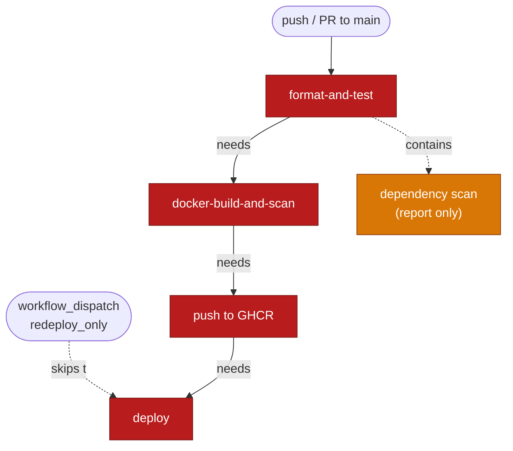

```mermaid
flowchart TD
    T1(["push / PR to main"]) --> A
    T2(["workflow_dispatch<br/>redeploy_only"]) -.skips to.-> D

    A["format-and-test"]:::gate
    B["docker-build-and-scan"]:::gate
    C["push to GHCR"]:::gate
    D["deploy"]:::gate
    R["dependency scan<br/>(report only)"]:::report

    A -->|needs| B
    B -->|needs| C
    C -->|needs| D
    A -.contains.-> R

    classDef gate fill:#b91c1c,stroke:#7f1d1d,color:#fff
    classDef report fill:#d97706,stroke:#92400e,color:#fff
```