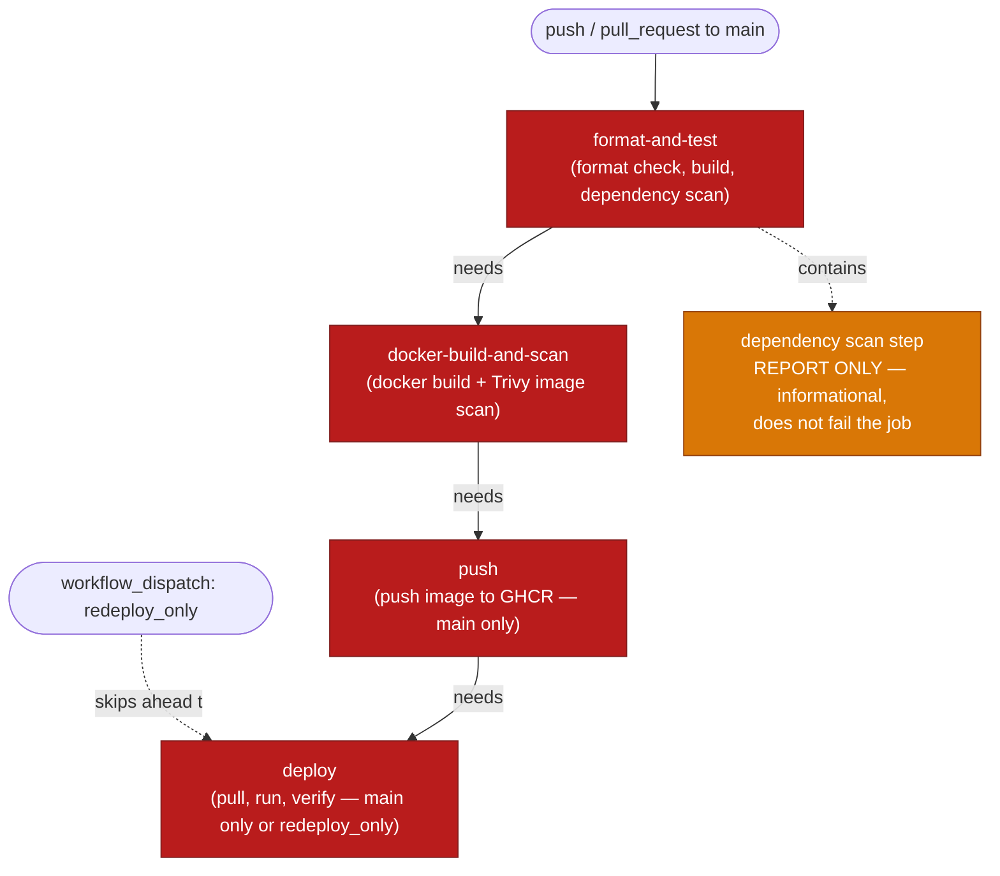

# CI/CD Pipeline Diagram

**Gate (red)** — a failure here stops everything downstream: `needs:` chains
format-and-test → docker-build-and-scan → push → deploy in sequence, so a broken
format check, failed build, or a HIGH/CRITICAL Trivy finding blocks the image from
ever being pushed or deployed. Verified live: intentionally broke formatting,
watched the whole pipeline stop at that step.

**Report (orange)** — `dotnet list package --vulnerable` inside format-and-test
surfaces known-vulnerable NuGet packages but always exits 0 regardless of findings,
so it doesn't fail the job on its own. The actual enforcement point for
vulnerabilities is the Trivy image scan in docker-build-and-scan, which does gate
(`exit-code: 1`).

**workflow_dispatch** is a second, independent entry point directly into `deploy`,
bypassing format-and-test/docker-build-and-scan/push entirely when `redeploy_only`
is set — redeploys the last already-pushed image without a new build.