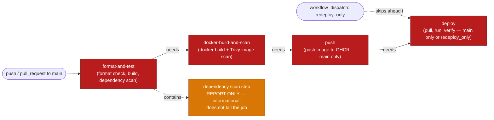

```mermaid
flowchart LR
    T1(["push / pull_request to main"]) --> A
    T2(["workflow_dispatch: redeploy_only"]) -.skips ahead to.-> D

    A["format-and-test<br/>(format check, build, dependency scan)"]:::gate
    B["docker-build-and-scan<br/>(docker build + Trivy image scan)"]:::gate
    C["push<br/>(push image to GHCR — main only)"]:::gate
    D["deploy<br/>(pull, run, verify — main only or redeploy_only)"]:::gate
    R["dependency scan step<br/>REPORT ONLY — informational,<br/>does not fail the job"]:::report

    A -->|needs| B
    B -->|needs| C
    C -->|needs| D
    A -.contains.-> R

    classDef gate fill:#b91c1c,stroke:#7f1d1d,color:#fff
    classDef report fill:#d97706,stroke:#92400e,color:#fff
```